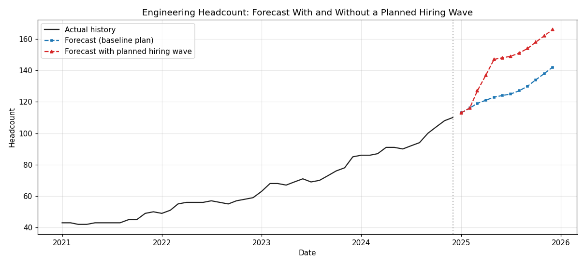
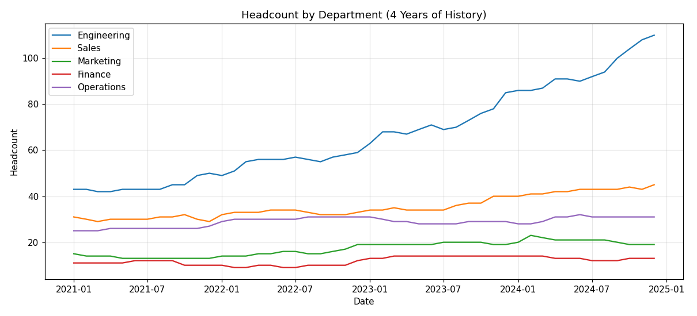
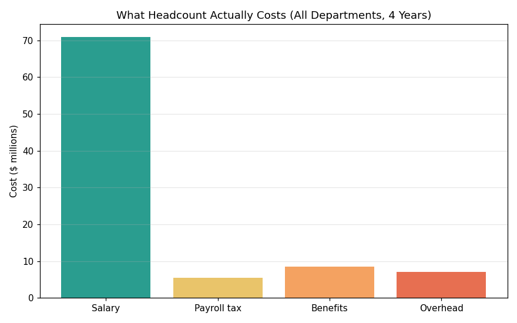

# Workforce Headcount & Cost Forecasting

A planning tool that forecasts a company's future **headcount** and **fully loaded cost** by department — and lets a planner adjust the forecast for events they already know are coming, like a hiring wave, a hiring freeze, or a reorganization.

Think of it as a smarter version of the spreadsheet that finance and HR teams use to answer two questions every planning cycle:

> *How many people will we have next year — and what will they actually cost?*



*The chart above shows the core idea: the model projects headcount forward (blue), and a planner can layer a known event on top — here, a planned hiring wave — to see its impact instantly (red).*

---

## Why this project exists

Most headcount forecasts have two weaknesses, and this project is built to fix both:

**1. They only look backward.** A purely statistical forecast assumes the future looks like the past. But planners usually *know* things the data doesn't — a new team launching in March, a hiring freeze in Q3. This tool lets them layer those known events on top of the statistical forecast, so the plan reflects reality.

**2. They forecast salary, not true cost.** An employee costs far more than their base salary once you add payroll taxes, health benefits, and overhead (equipment, software, workspace). This tool calculates the **fully loaded cost** — roughly 1.3× salary — so the forecast is a real budget number, not an underestimate.

---

## What it can do

- **Forecast headcount** for any department, up to two years out.
- **Choose between two forecasting methods** — a simple, easy-to-explain one and a more sophisticated one that captures seasonal hiring patterns.
- **Layer in known future events** month by month — add hires for a planned onboarding class, or freeze attrition during a restructure.
- **Translate headcount into a true budget** by including payroll taxes, benefits, and overhead — all adjustable.
- **Compare scenarios** to answer questions like *"What does this hiring decision actually cost us over the year?"*

---

## See it in action

The project includes an interactive app (built with Streamlit) where you can point and click — pick a department, drag sliders, and watch the forecast update. No coding required to use it.

It also includes two analysis notebooks that walk through the thinking step by step, with charts and plain-language explanations.

### A few of the insights it surfaces

**Growth isn't evenly spread.** Over four years, the Engineering team more than doubled while other departments stayed roughly flat — the kind of nuance a company-wide average would hide.



**Headcount costs much more than salary alone.** Payroll taxes, benefits, and overhead add about 30% on top of base salary. Planning on salary alone would significantly understate the budget.



---

## How it works, in plain terms

Rather than guessing future headcount directly, the tool forecasts the two things that actually change it — **hires** and **departures** — and then builds headcount forward month by month:

> next month's headcount = this month's headcount + hires − departures

This mirrors how real planning works, and it's what makes the "known events" feature natural: a planner adjusts the hires and departures they control, and the headcount (and cost) follows automatically.

The two forecasting methods are:

- **Baseline** — predicts each future month using the historical average for that calendar month. Simple and easy to sanity-check by hand.
- **Holt-Winters** — a well-established statistical method that captures both the long-term trend and the repeating seasonal pattern (for example, stronger hiring in Q1, a summer slowdown).

The cost calculation starts from salary and adds three components, each adjustable:

| Component | Typical rate | What it covers |
|---|---|---|
| Payroll taxes | ~7.65% | Employer payroll taxes (US FICA / Canadian CPP & EI) |
| Health & benefits | ~12% | Medical, dental, retirement matching, insurance |
| Other overhead | ~10% | Equipment, software, workspace, training |

Together these give a **loading factor of about 1.3×** base salary — in line with the common industry rule of thumb.

> **Note on the data:** Real HR data is private, so this project uses a realistic *simulated* dataset (5 departments, 4 years of monthly data) generated to behave like real workforce data — with growth trends, attrition, seasonal hiring, and random month-to-month variation.

---

## Project structure

```
workforce-forecasting/
├── README.md                      ← you are here
├── requirements.txt               ← the libraries needed to run it
├── data/
│   └── headcount_data.csv         ← the dataset
├── src/
│   ├── generate_data.py           ← creates the simulated dataset
│   └── forecast.py                ← the core forecasting logic
├── notebooks/
│   ├── 01_exploration.ipynb       ← exploring the data, with charts
│   └── 02_forecasting.ipynb       ← the forecasting walkthrough
└── app/
    └── streamlit_app.py           ← the interactive point-and-click tool
```

---

## Running it yourself (technical setup)

If you'd like to run the project locally:

**1. Install the requirements** (one time):

```bash
pip install -r requirements.txt
```

**2. (Optional) Regenerate the dataset:**

```bash
python src/generate_data.py
```

**3. Launch the interactive app:**

```bash
streamlit run app/streamlit_app.py
```

This opens the tool in your web browser.

**4. Or open the notebooks** to read through the analysis:

```bash
jupyter notebook
```

Then open either notebook in the `notebooks/` folder.

---

## Tools used

Python, pandas, statsmodels (for the Holt-Winters forecasting), matplotlib (charts), and Streamlit (the interactive app).

---

## A note on scope

This is a portfolio project built to demonstrate a complete, realistic workflow — from generating data, to exploring it, to forecasting, to a usable tool — with a focus on the kind of thinking that matters in financial and workforce planning. The dataset is simulated, but the methods and the cost model reflect how this problem is approached in practice.
